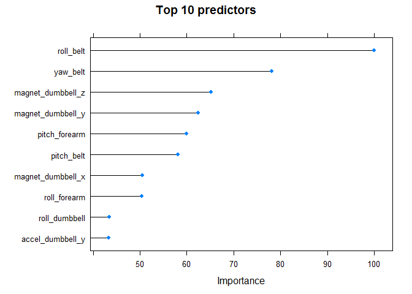
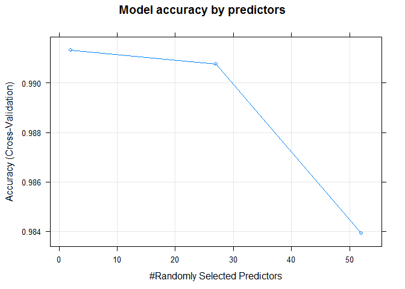

# Practical Machine Learning Course Project
Gregorio Ambrosio Cestero  
March 22, 2016  

## Background

Using devices such as Jawbone Up, Nike FuelBand, and Fitbit it is now possible to collect a large amount of data about personal activity relatively inexpensively. These type of devices are part of the quantified self movement – a group of enthusiasts who take measurements about themselves regularly to improve their health, to find patterns in their behavior, or because they are tech geeks. One thing that people regularly do is quantify how much of a particular activity they do, but they rarely quantify how well they do it. In this project, your goal will be to use data from accelerometers on the belt, forearm, arm, and dumbell of 6 participants. They were asked to perform barbell lifts correctly and incorrectly in 5 different ways.

More information is available from the website here: http://groupware.les.inf.puc-rio.br/har (see the section on the Weight Lifting Exercise Dataset).

## Goal

The 5 different ways were labeled as A,B,C,D and E. The goal of this project is to predict the manner in which they did the exercise, i.e., the variable classe (A to E).

## Summary

A random forest machine learning model was built using 5-fold cross-validation based on a training dataset.

## Loading data and needed packages

First of all, as usual, we load the R packages needed for the code and then download the training and testing data sets.


```r
# Needed packages

library(ggplot2)
library(caret)
library(randomForest)

# Loading data

pmlTrainingFile <- "pml-training.csv"
pmlTestFile     <- "pml-testing.csv"

pmlTrainingUrl  <- "https://d396qusza40orc.cloudfront.net/predmachlearn/pml-training.csv"
pmlTestUrl      <- "https://d396qusza40orc.cloudfront.net/predmachlearn/pml-testing.csv"

if (!file.exists(pmlTrainingFile)) {
  download.file(pmlTrainingUrl, pmlTrainingFile, method="curl")
}

if (!file.exists(pmlTestFile)) {
  download.file(pmlTestUrl, pmlTestFile, method="curl")
}

pmlTraining <- read.csv(pmlTrainingFile, na.strings = c("", "NA", "#DIV/0!"))
pmlTesting  <- read.csv(pmlTestFile,     na.strings = c("", "NA", "#DIV/0!"))
```

Training data has 19622 rows of 160 variables, while testing data has only 20 rows of the same number of variables.

## Preparing data

We remove variables with missing or empty values and, after that, we remove unnecessary variables (predictors) getting a final set of 53 variables. 

Finally, we split the training data set into train data and validation data with a rate of 70:30. The validation data let us to compute the out-of-sample error. 


```r
## Removing variables with NAs or empty
pmlTraining.cleaned <- pmlTraining [, colSums(is.na(pmlTraining)) == 0]
pmlTesting.cleaned  <- pmlTesting  [, colSums(is.na(pmlTesting))  == 0]


## Removing unnecessary variables
colsNotNeeded <- c("X", "user_name", "raw_timestamp_part_1", "raw_timestamp_part_2", "cvtd_timestamp", "new_window", "num_window")
pmlTraining.cleaned <- pmlTraining.cleaned [, -which(names(pmlTraining.cleaned) %in% colsNotNeeded)]
pmlTesting.cleaned  <- pmlTesting.cleaned  [, -which(names(pmlTesting.cleaned)  %in% colsNotNeeded)]

## Spliting training data
set.seed(1111)
toTrain <- createDataPartition(pmlTraining.cleaned$classe, p=0.7, list=FALSE)
pmlTraining.cleaned.trainSet      <- pmlTraining.cleaned[ toTrain, ]
pmlTraining.cleaned.validationSet <- pmlTraining.cleaned[-toTrain, ]
```

## Modeling & Results

For our prediction algorithm we use random forest method. We use this machine learning model with 5-fold cross validation, saving some computing time.


```r
pmlModelRandomForest <- train(classe ~ .,
                              data          = pmlTraining.cleaned.trainSet,
                              method        = "rf",
                              trControl     = trainControl(method="cv", number=5)
)
pmlModelRandomForest
```

```
## Random Forest 
## 
## 13737 samples
##    52 predictor
##     5 classes: 'A', 'B', 'C', 'D', 'E' 
## 
## No pre-processing
## Resampling: Cross-Validated (5 fold) 
## Summary of sample sizes: 10990, 10990, 10989, 10990, 10989 
## Resampling results across tuning parameters:
## 
##   mtry  Accuracy   Kappa      Accuracy SD  Kappa SD   
##    2    0.9913370  0.9890406  0.001846666  0.002337396
##   27    0.9907547  0.9883042  0.001832078  0.002318439
##   52    0.9839115  0.9796477  0.004470503  0.005654771
## 
## Accuracy was used to select the optimal model using  the largest value.
## The final value used for the model was mtry = 2.
```

We test the model on the validation dataset and get the confusion matrix.


```r
validationPredictRandomForest <- predict(pmlModelRandomForest, pmlTraining.cleaned.validationSet)
confMatrixRndomForest <- confusionMatrix(pmlTraining.cleaned.validationSet$classe, validationPredictRandomForest)
confMatrixRndomForest
```

```
## Confusion Matrix and Statistics
## 
##           Reference
## Prediction    A    B    C    D    E
##          A 1674    0    0    0    0
##          B    5 1129    5    0    0
##          C    0    9 1015    2    0
##          D    0    0   19  945    0
##          E    0    0    0    2 1080
## 
## Overall Statistics
##                                           
##                Accuracy : 0.9929          
##                  95% CI : (0.9904, 0.9949)
##     No Information Rate : 0.2853          
##     P-Value [Acc > NIR] : < 2.2e-16       
##                                           
##                   Kappa : 0.991           
##  Mcnemar's Test P-Value : NA              
## 
## Statistics by Class:
## 
##                      Class: A Class: B Class: C Class: D Class: E
## Sensitivity            0.9970   0.9921   0.9769   0.9958   1.0000
## Specificity            1.0000   0.9979   0.9977   0.9962   0.9996
## Pos Pred Value         1.0000   0.9912   0.9893   0.9803   0.9982
## Neg Pred Value         0.9988   0.9981   0.9951   0.9992   1.0000
## Prevalence             0.2853   0.1934   0.1766   0.1613   0.1835
## Detection Rate         0.2845   0.1918   0.1725   0.1606   0.1835
## Detection Prevalence   0.2845   0.1935   0.1743   0.1638   0.1839
## Balanced Accuracy      0.9985   0.9950   0.9873   0.9960   0.9998
```
The estimated accuracy of the model on the validation dataset is 99.29 % and the estimated out of sample error is 0.71%.

## Testing

This model is able to predict 100% of the 20 cases provided in the testing dataset.

## Some plots

```r
plot(varImp(pmlModelRandomForest), main = "Top 10 predictors", top = 10)
```

 

```r
plot(pmlModelRandomForest, main="Model accuracy by predictors")
```

 


